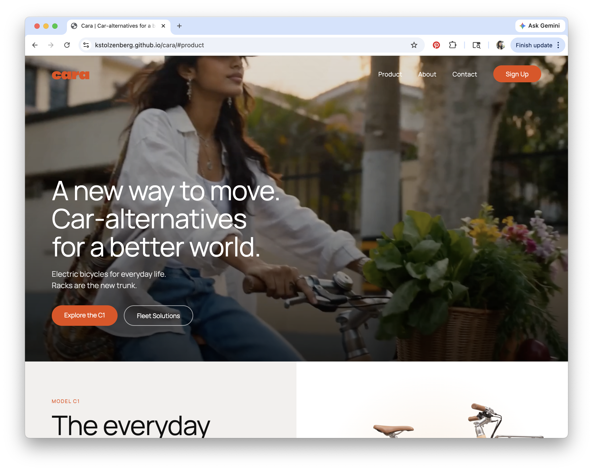

# Cara
Concept for a car-alternative e-bike brand. 

- Brand concept composed in Figma
- Brand assets created with Fuser Studio
- HTML created with Claude Chat
- Deployed on [Github Pages](https://kstolzenberg.github.io/cara/)

</img>

